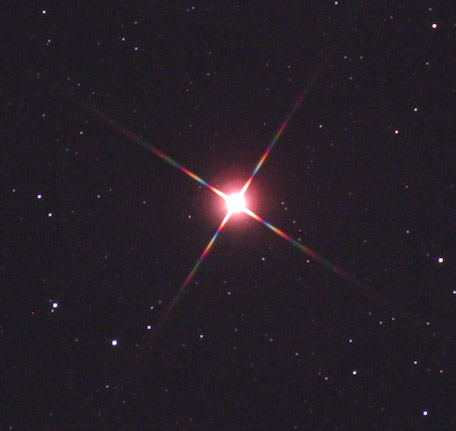
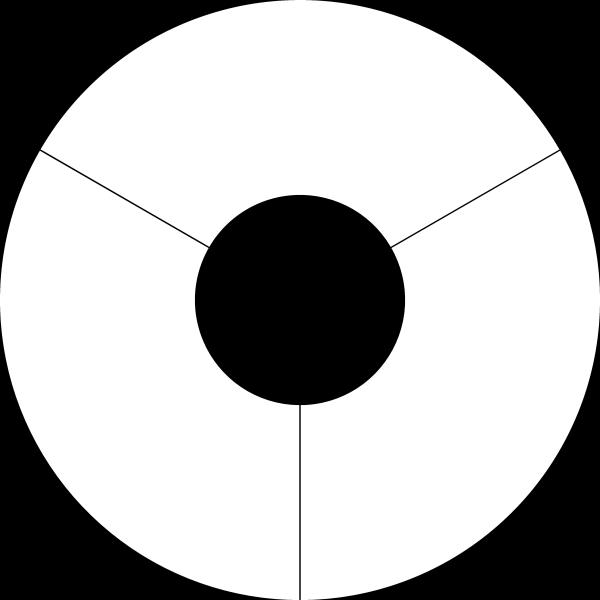
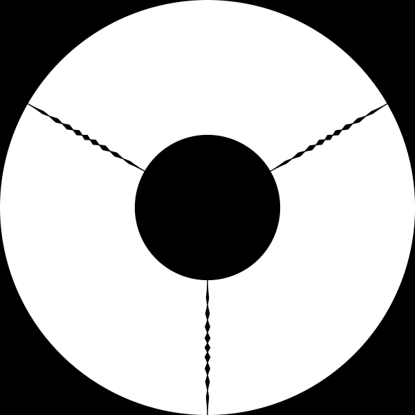

# Mask_opt
Many telescope designs require spider vanes to support a secondary mirror. These induce diffraction spikes (concentrated, wavelength sensitive imaging artifacts) which interact poorly with standard deconvolution techniques and can disrupt multiframe blind deconvolution.
By modulating the edges of the aperture with a mask, constructive interference in the outer regions of the spikes can be limited.
This project seeks to find an optimised edge supported binary aperture mask of high airy efficiency for producing images with a compact, radially symmetric, wavelength insensitive point spread function (PSF).
High numerical aperture (NA) imaging systems can exceed the valid range of the Fresnel approximation, requiring the use of an angular spectrum method (ASM) optimised for focal point simulation.

## Scope
 - [x] Parallel 2D FFT
 - [x] Rayleigh-Sommerfeld diffraction integral (slow baseline)
 - [x] Single step Fresnel diffraction
    - [ ] Double step Fresnel diffraction (image plane scaling)
 - [x] Satoru Odate ASM (Allow high NA and scaling without aliasing)
   - [x] Scaling CZT
   - [x] Type I
   - [ ] Type II
   - [ ] Type III
   - [ ] Type IV
 - [ ] Mask parameterisation and rendering
 - [ ] Loss function
    - [ ] Spatial entropy of radially monotonic base PSF
    - [ ] Differential entropy of each wavelengths true PSF over base
 - [ ] Optimisation and result
    - [ ] Integrate with existing CMA-ES optimiser
    - [ ] Output mask as STL for fabrication

## Wavelength Sensitivity
Below is an example the wavelength sensitivity of diffraction spikes. The rainbow appearance of the outer extent of the spikes indicates where the PSF changes the most with wavelength.

## Unmodified example
This is an unmodified example aperture and the resulting PSF as determined via the Rayleigh-Sommerfeld integral.
Note that straight edges of the spider vane produce diffraction which constructively interferes even at large displacements.

## Masked Example
A manual (non-optimised) modification of the aperture results in spikes which decay rapidly.
It is expected that this can be improved upon by optimisation, and by also allowing modulation of the outer edge of the aperture.

## License
MIT

## References
Satoru Odate et al., *Angular spectrum calculations for arbitrary focal length with a scaled convolution*, Core Technology Center - Nikon Corporation

Joseph W. Goodman, *Introduction to Fourier Optics*, Stanford University
